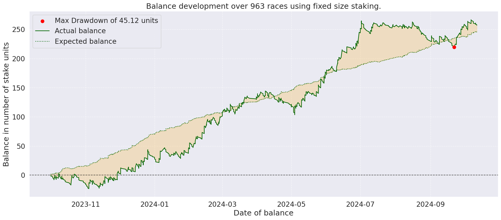

# Horse Race Probability Prediction

An end-to-end machine learning pipeline for **horse race probability prediction**: 
it scrapes data, preprocesses and engineers features, trains a **LightGBM gradient-boosted ranking model**,
and backtests strategies with bankroll simulation and plots using **EV-Betting**.

---

## 📊 Backtest results

- Model is able to achieve on average about **5%** more accurate predictions than pre-race market odds on the day before the race. 
- **Note**: This edge naturally diminishes when getting closer to the closing lines and the model 
is not profitable anymore few hours before the race. It is just exploiting market maker mistakes.

---

## 🔎 What this repo does

- **Data collection**: scrape raw race cards, odds, results
- **Preprocessing & feature engineering**: build training sets from historical races
- **Modeling**: LightGBM ranking model to estimate **win/place probabilities**
- **Backtesting**: simulate betting with configurable staking (e.g., fixed, Kelly)
- **Reporting**: compute yield, profit per bet/day, drawdowns, and produce plots

## 🚀 How to Run

- Run ModelTuning/simulate.py for simulations.
- DataCollection/TrainDataCollector.py is the script for scraping the data.
- Directory "notebooks" contains jupyter notebooks to plot simulation data as well as live data.
